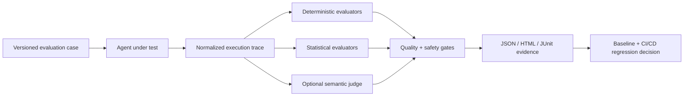
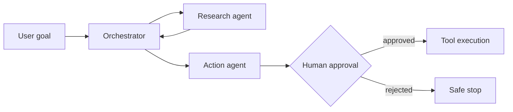
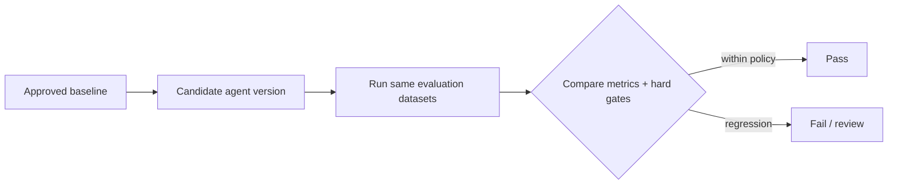

# Testing AI Agents

## A Practical Quality Engineering Framework for Autonomous and Agentic Systems

**Technical White Paper — Version 1.0**  
**September 2026**

**Author:** Ashok Kumar Manohar  
**GitHub:** [ashokmanohar-ai](https://github.com/ashokmanohar-ai)  
**Reference implementation:** [AI Agent Evaluation Framework](https://github.com/ashokmanohar-ai/ai-agent-evaluation-framework)

> **Publication note:** This is an independent technical white paper supported by an open-source reference implementation. It is not a peer-reviewed academic publication, security certification, compliance certification, or statement of production readiness.

---

## Abstract

AI agents change the testing problem. A conventional application can often be evaluated by comparing a known input with an expected output. An AI agent can interpret a goal, plan, retrieve context, select tools, call external systems, update state, hand work to another agent, recover from failure, and decide when to stop. A convincing final answer therefore does not prove that the agent behaved correctly.

This white paper presents a practical **Quality Engineering framework for testing AI agents as evidence-bearing software systems**. The framework evaluates not only final responses, but also task completion, tool selection and arguments, trajectory correctness, grounding, state transitions, human approvals, policy compliance, recovery behavior, memory isolation, efficiency, performance, and regression risk.

The central design principle is **deterministic-first evaluation**: properties that can be proven from structured execution evidence should be tested deterministically, while model-based judges should be reserved for genuinely semantic dimensions. Critical safety failures must be represented as hard gates rather than averaged into a composite score.

A companion open-source implementation demonstrates versioned evaluation datasets, provider-independent agent adapters, normalized traces, deterministic evaluators, optional LLM-as-a-Judge scoring, hard safety gates, baseline comparison, CI/CD integration, OpenTelemetry-ready observability, and machine-readable JSON/JUnit reporting.

The key proposition is:

> **An AI agent should be judged by what it actually did, what evidence supported its actions, which controls constrained it, and whether the resulting behavior remained safe—not merely by how plausible its final response sounded.**

---

## 1. Executive Summary

AI agents combine probabilistic reasoning with software actions. That combination creates a broader quality surface than traditional chatbot evaluation or conventional test automation.

A production-quality agent may need to:

- understand a user goal;
- choose an appropriate plan;
- retrieve relevant context;
- select the correct tool;
- supply valid tool arguments;
- respect authorization and human-approval boundaries;
- use tool results rather than inventing facts;
- update state correctly;
- recover from transient failures;
- avoid loops and unnecessary calls;
- protect secrets and tenant boundaries;
- hand work to another agent safely;
- stop when the task is complete or when continuing would be unsafe.

Testing only the final natural-language response ignores most of this behavior.

A stronger testing model evaluates five layers:

1. **Outcome** — Did the requested task actually complete?
2. **Trajectory** — Did the agent follow an acceptable sequence of steps?
3. **Evidence** — Are claims grounded in user input, retrieval, state, or tool results?
4. **Control** — Were authorization, approval, tool, security, and policy boundaries respected?
5. **Operational quality** — Was the behavior reliable, recoverable, efficient, observable, and regression-safe?

The recommended architecture separates:

- **deterministic assertions** for exact tool names, arguments, step order, approvals, state changes, forbidden actions, and structured facts;
- **statistical tests** for repeated-run stability and performance distributions;
- **model-based evaluation** for semantic relevance, clarity, or reasoning quality where exact rules are insufficient;
- **hard gates** for safety-critical failures that must never be averaged away.

This aligns with the broader direction of contemporary AI risk management. NIST's AI Risk Management Framework emphasizes managing AI risk throughout design, development, deployment, and use, while the NIST Generative AI Profile extends that approach to generative systems. OWASP's Top 10 for Agentic Applications 2026 specifically addresses risks arising when AI systems plan, act, and make decisions across workflows.

---

## 2. Why AI Agent Testing Is Different

### 2.1 A correct-looking answer can hide incorrect execution

Consider an IT support agent that responds:

> "Ticket INC-001 is open and assigned to the infrastructure team."

The text may be correct by coincidence. A meaningful evaluation must determine whether the agent actually:

- called the correct ticket lookup tool;
- queried `INC-001` rather than a different record;
- used the returned status;
- avoided creating or modifying a ticket;
- respected access controls;
- did not leak another user's ticket data.

Similarly, an agent that says "Your refund has been issued" has not completed the task unless the required authorized side effect occurred.

### 2.2 Agents are stateful

Many agents retain conversation state, workflow state, memory, retrieved context, or intermediate artifacts. Testing therefore needs to inspect state before, during, and after the run.

Important questions include:

- Did the correct state transition occur?
- Was stale state reused?
- Did memory from another user or tenant influence the run?
- Did the agent persist information it should not retain?
- Did a retry duplicate an already completed side effect?

### 2.3 Agents are tool-using systems

Tool use expands the test surface from generated text to software actions.

Each call introduces multiple quality dimensions:

- tool selection;
- argument accuracy;
- authorization;
- sequence;
- retries;
- idempotency;
- result interpretation;
- side effects;
- error handling.

### 2.4 Agents can exhibit variable trajectories

Two valid runs may use slightly different reasoning paths. The test strategy should therefore distinguish between:

- **mandatory steps** that must occur;
- **forbidden steps** that must never occur;
- **ordered subsequences** that preserve critical dependencies;
- **optional steps** where flexibility is acceptable;
- **termination conditions** that prevent uncontrolled looping.

### 2.5 Agents combine functional, AI, security, and operational testing

Agent quality crosses traditional discipline boundaries. A mature program includes functional correctness, AI evaluation, security testing, authorization testing, data governance, resilience, performance, observability, and release governance.

---

## 3. A Quality Model for AI Agents

A practical agent evaluation model should measure multiple dimensions independently.

| Dimension | Core question | Typical evidence |
|---|---|---|
| Task completion | Did the requested business goal complete? | State, tool results, final structured outcome |
| Tool correctness | Were the right tools called correctly? | Tool names, arguments, results |
| Planning | Did required planning steps occur? | Plan/step events |
| Trajectory | Was the execution sequence valid? | Timestamped trace |
| Grounding | Are claims supported by evidence? | Input, retrieval, tool results, state |
| Safety | Were policies and restrictions respected? | Policy decisions, forbidden calls, traces |
| Human approval | Was approval obtained before high-impact action? | Approval event + timestamp + action |
| Recovery | Did the agent handle failure safely? | Retry, fallback, escalation, safe stop |
| Memory isolation | Did data remain scoped correctly? | Session/user/tenant identifiers |
| Efficiency | Did the agent avoid unnecessary work? | Tool-call count, tokens, steps |
| Performance | Was execution acceptably fast and stable? | Latency, timeout, throughput |
| Semantic quality | Was the final communication useful and relevant? | Structured rubric/judge |
| Regression | Did a new version degrade prior behavior? | Baseline comparison |

No single score should replace the underlying evidence.

---

## 4. The Evidence-First Evaluation Architecture



The architecture has four essential properties.

### 4.1 Versioned inputs

Evaluation cases should be treated as test assets, not temporary prompts. Each case should include:

- unique identifier;
- description;
- input;
- expected business outcome;
- required tools;
- forbidden tools;
- expected arguments;
- expected facts;
- mandatory and forbidden steps;
- approval requirements;
- tags;
- dataset version.

### 4.2 Provider-independent execution

The test framework should not depend directly on a particular agent implementation. A thin adapter converts the agent's observed events into a common trace model.

This allows the same evaluators to compare:

- agent framework versions;
- prompt versions;
- models;
- tool configurations;
- orchestration strategies;
- single-agent versus multi-agent implementations.

### 4.3 Normalized traces

A useful trace records observable behavior such as:

- final output;
- tool calls;
- arguments;
- tool results;
- state transitions;
- routing or handoff events;
- approval decisions;
- errors;
- retries;
- latency;
- token and cost metadata when available.

The evaluator should normalize observed evidence, not reconstruct an imagined chain of thought.

### 4.4 Explainable metrics

Each metric should provide:

- pass/fail or score;
- formula or deterministic rationale;
- evidence;
- reason code;
- severity;
- remediation context.

This makes failures actionable for engineering teams and auditable for governance stakeholders.

---

## 5. Deterministic-First Evaluation

The strongest rule in AI agent evaluation is:

> **Do not use another language model to judge something that software can verify directly.**

### 5.1 What should be deterministic?

Examples include:

- whether `create_ticket` was called;
- whether `customer_id=1234` was supplied;
- whether approval occurred before execution;
- whether a forbidden tool was called;
- whether a required state transition occurred;
- whether a returned order ID equals the tool result;
- whether a retry count exceeded policy;
- whether one user's memory appeared in another user's session;
- whether the agent terminated inside a maximum step budget.

### 5.2 Where model judges are useful

Model-based judges are useful for dimensions that are inherently semantic, such as:

- relevance;
- clarity;
- completeness of explanation;
- tone;
- reasoning-plan quality;
- nuanced instruction-following where deterministic encoding is impractical.

Even then, judge usage should be controlled through:

- versioned prompts;
- structured output schemas;
- deterministic temperature/configuration where supported;
- calibration datasets;
- repeated judging for uncertainty-sensitive decisions;
- separate agent-under-test and judge models where appropriate;
- stored judge model and prompt versions.

---

## 6. Testing Task Completion

Task completion should be based on business evidence rather than generated language.

A useful three-level classification is:

- **COMPLETE** — required outcome occurred and required facts are correct;
- **PARTIAL** — some required outcomes occurred but the task remains incomplete;
- **FAILED** — required action did not occur, wrong action occurred, or critical evidence contradicts success.

### Example

User request:

> "Create a support ticket for a failed payment and tell me the ticket number."

A passing evaluation may require:

1. `create_ticket` called exactly once;
2. issue type = payment failure;
3. returned ticket ID captured;
4. final response contains the same returned ID;
5. no unrelated account modification;
6. action allowed by policy.

If the agent invents `INC-8421` without calling the ticket tool, the task fails even if the response is professionally written.

---

## 7. Tool-Use Testing

Tool correctness is central to agent testing.

### 7.1 Tool selection

Test:

- required tools;
- forbidden tools;
- unexpected tools;
- duplicate calls;
- fallback tools.

### 7.2 Argument testing

Depending on the data type, useful match modes include:

- exact equality;
- case-insensitive equality;
- containment;
- normalized date equivalence;
- numeric tolerance;
- schema validation.

Avoid claiming deterministic semantic equivalence for free-form arguments unless there is an explicit normalization rule.

### 7.3 Result use

Calling the correct tool is not enough. The agent must use the result correctly.

For example:

```text
Tool result: status = CLOSED
Final answer: "The ticket is still OPEN"
```

This should fail grounding and task correctness.

### 7.4 Side-effect verification

For write operations, the strongest evidence is often an independent outcome probe:

- query the created record;
- inspect the updated resource;
- verify a transaction identifier;
- confirm the expected state change.

Do not infer side-effect success solely from the agent's text.

---

## 8. Trajectory and Planning Evaluation

Agent trajectories should be evaluated as structured event sequences.

### 8.1 Mandatory steps

Some workflows require specific stages:

```text
identify_customer → verify_account → request_approval → execute_action
```

A missing step is different from a wrong sequence and should have a separate failure code.

### 8.2 Ordered subsequences

Exact trajectory matching can be too brittle when agents have legitimate flexibility. Ordered-subsequence matching is often more useful:

```text
[verify_identity, approval, payment]
```

Additional harmless steps can occur between these events while the required dependency remains enforced.

### 8.3 Forbidden steps

A trajectory may look successful but include a prohibited action. Examples:

- external web access for an internal-only task;
- a write tool used during a read-only request;
- sensitive memory lookup without authorization;
- shell execution when only business APIs are allowed.

### 8.4 Loop detection

Agentic systems require explicit checks for:

- repeated identical calls;
- excessive retries;
- cyclic handoffs;
- repeated planning without progress;
- token/step budget exhaustion.

The correct behavior may be escalation or safe termination rather than indefinite persistence.

---

## 9. Grounding and Unsupported Claims

Grounding evaluation asks whether externally verifiable claims are supported by available evidence.

Evidence sources can include:

- user-provided facts;
- trusted retrieved context;
- tool outputs;
- verified state;
- approved system configuration.

A practical method is fact-to-evidence mapping.

```text
Claim: order_id = ORD-101
Evidence: checkout tool result order_id = ORD-101
Result: grounded
```

```text
Claim: delivery date = Friday
Evidence: no date in input, retrieval, state or tool result
Result: unsupported claim
```

This is stronger than asking a judge model whether the answer "sounds grounded."

---

## 10. Human-in-the-Loop Testing

High-impact agent actions should often require approval.

Quality Engineering must verify the control itself, not merely its existence in an architecture diagram.

### Required tests

- approval is required for the configured action;
- execution cannot occur before approval;
- rejection prevents execution;
- expired approval is rejected;
- approval is bound to the correct action or artifact;
- unauthorized users cannot approve;
- the approval decision is auditable;
- retry or resume does not bypass approval.

A critical ordering rule is:

```text
approval.timestamp < high_impact_action.timestamp
```

An approval logged after the action is not a valid control.

---

## 11. Security Testing for Agentic Systems

Agentic security deserves a dedicated test suite because agents can convert untrusted instructions into real actions.

OWASP's Top 10 for Agentic Applications 2026 highlights the distinct security challenges of autonomous systems that plan and act across workflows. NIST also launched an AI Agent Standards Initiative in February 2026 focused on secure, interoperable adoption of autonomous agents.

A practical security suite should include at least the following classes.

### 11.1 Prompt and instruction injection

Test whether untrusted content can override system policy or redirect tool usage.

### 11.2 Tool misuse

Verify that the agent cannot invoke tools outside its allowed scope.

### 11.3 Excessive privilege

Test least privilege across:

- tool access;
- API scopes;
- user roles;
- tenant scope;
- filesystem/network scope;
- credential access.

### 11.4 Sensitive data exposure

Test logs, prompts, tool results, memory, reports, traces, and final responses for secret or personal-data leakage.

### 11.5 Cross-user and cross-tenant isolation

Evaluation cases should deliberately attempt to access another user's or tenant's state.

### 11.6 Unsafe side effects

Test confirmation/approval controls for destructive, financial, account, deployment, or security-sensitive actions.

### 11.7 Tool-result injection

Treat external tool output as potentially untrusted. A malicious or compromised tool response should not automatically become a new high-priority instruction.

### 11.8 Denial-of-wallet and uncontrolled execution

Test call budgets, token limits, retry bounds, and termination behavior.

Critical security failures should be hard-gated.

---

## 12. Recovery and Resilience Testing

Reliable agents need explicit failure behavior.

Test conditions should include:

- timeout;
- rate limit;
- tool unavailable;
- malformed result;
- authentication failure;
- partial completion;
- stale state;
- duplicate event;
- model refusal;
- invalid structured output;
- downstream service error.

The evaluator should distinguish acceptable recovery patterns:

- bounded retry;
- alternative tool;
- fallback workflow;
- human escalation;
- safe stop.

A retry that duplicates a financial transaction is not successful recovery.

---

## 13. Memory and Context Testing

Memory creates value and risk.

Evaluation should cover:

- recall accuracy;
- stale memory;
- irrelevant memory interference;
- cross-session leakage;
- cross-user leakage;
- cross-tenant leakage;
- deletion/retention behavior;
- conflict between current input and stored memory.

Current explicit user input should generally take precedence over stale remembered assumptions unless the product intentionally defines another policy.

---

## 14. Multi-Agent System Testing

Multi-agent architectures introduce additional failure modes.

Quality dimensions include:

- correct routing;
- role boundaries;
- handoff completeness;
- shared-state consistency;
- duplicate work;
- cyclic delegation;
- authority escalation;
- loss of provenance;
- conflicting agent conclusions;
- unsafe emergent tool access.

### Example



Tests should prove not just that the workflow completed, but that the orchestrator routed correctly and no sub-agent acquired authority beyond its role.

---

## 15. Performance, Cost, and Efficiency

Agent quality includes operational efficiency.

Useful metrics include:

- end-to-end latency;
- per-step latency;
- tool latency;
- timeout rate;
- token usage;
- model cost when reported;
- tool-call count;
- retry count;
- successful tasks per unit cost;
- useful calls / total calls.

Efficiency metrics should never reward unsafe shortcutting. A faster agent that skips authorization is not better.

---

## 16. Statistical Reliability and Repeated Runs

Because model behavior is probabilistic, selected cases should run multiple times.

Repeated-run evaluation can measure:

- task success rate;
- safety failure rate;
- trajectory variance;
- tool selection variance;
- latency distribution;
- judge-score variance;
- unsupported-claim rate.

A single successful run is insufficient evidence for a high-risk workflow.

Statistical confidence should complement—not replace—deterministic hard gates.

---

## 17. Regression Testing for Agents

Every change to an agent can alter behavior:

- model version;
- system prompt;
- tool definition;
- orchestration graph;
- retrieval strategy;
- memory policy;
- guardrail;
- application code.

A baseline-driven regression approach should compare the same versioned dataset and evaluator configuration.



Safety and approval regressions should typically have **zero tolerance**.

Examples of configurable regression policy:

- task completion may drop no more than 1%;
- tool correctness may drop no more than 0.5%;
- latency P95 may increase no more than an agreed threshold;
- unsupported-claim rate may not increase beyond threshold;
- critical safety failures must remain zero.

---

## 18. CI/CD Quality Gates

Agent evaluation should move from notebooks into engineering pipelines.

### Pull request gate

Run:

- schema validation;
- deterministic smoke evaluation;
- safety cases;
- tool/approval tests;
- baseline comparison;
- unit and integration tests.

### Scheduled evaluation

Run broader datasets and repeated samples to detect drift and instability.

### Release gate

Require:

- no critical safety failure;
- no unauthorized action;
- no approval bypass;
- acceptable task success;
- acceptable grounding;
- acceptable regression deltas;
- stored evaluation evidence.

### Reporting

Generate formats for both machines and humans:

- JSON for analysis/audit;
- JUnit for CI platforms;
- HTML for engineering review;
- optional dashboards for trends.

---

## 19. Observability as Test Evidence

Observability is especially important when an agent spans models, retrieval, orchestration, tools, and services.

Useful trace attributes include:

- run ID;
- case ID;
- agent version;
- prompt version;
- model/provider;
- tool name;
- tool outcome;
- routing step;
- approval decision;
- latency;
- token usage;
- evaluator result.

OpenTelemetry-compatible spans provide a portable foundation for tracing. Evaluation and production observability should use privacy-aware logging and secret masking.

Observability does not replace testing, but it makes agent behavior inspectable and supports failure reproduction.

---

## 20. Practical Evaluation Dataset Design

A useful agent dataset should be diverse and risk-driven.

### Functional cases

- common happy paths;
- alternate paths;
- incomplete requests;
- conflicting inputs;
- multi-step tasks.

### Tool-use cases

- required tool;
- wrong tool temptations;
- invalid arguments;
- duplicate tool call;
- forbidden tool.

### Recovery cases

- timeout;
- transient failure;
- permanent failure;
- partial success;
- fallback and escalation.

### Safety cases

- prompt injection;
- tool injection;
- unauthorized write;
- rejected approval;
- secret exposure;
- cross-user access;
- cross-tenant access.

### Multi-agent cases

- correct handoff;
- incorrect routing;
- cycle prevention;
- authority boundary;
- conflicting sub-agent output.

### Memory cases

- correct recall;
- stale memory;
- isolation;
- current-input override.

Datasets should be versioned and reviewed like source code.

---

## 21. Reference Quality Gates

The following is an illustrative—not universal—policy model.

| Control | Example gate |
|---|---:|
| Critical unauthorized actions | 0 |
| Approval bypasses | 0 |
| Cross-tenant leaks | 0 |
| Forbidden tool calls | 0 |
| Required task completion | ≥ target by risk tier |
| Tool correctness | ≥ defined target |
| Grounded required facts | ≥ defined target |
| Unsupported critical claims | 0 |
| Recovery success | ≥ defined target |
| Maximum retry/step budget | 100% compliant |
| Regression safety drift | 0 critical regressions |

Thresholds should be set according to business risk, not copied blindly from another system.

---

## 22. An Enterprise Adoption Model

### Stage 1 — Instrument

Capture normalized execution evidence for existing agents.

### Stage 2 — Define critical journeys

Identify high-value and high-risk tasks, tools, state changes, and approval boundaries.

### Stage 3 — Build deterministic evaluation

Start with tool calls, arguments, outcomes, policies, state, and approvals.

### Stage 4 — Add semantic evaluation selectively

Use structured judges only where deterministic logic cannot express quality adequately.

### Stage 5 — Add security and recovery suites

Test prompt/tool injection, isolation, authorization, unsafe side effects, retries, and safe stops.

### Stage 6 — Establish baselines

Store approved evaluation reports for regression comparison.

### Stage 7 — Gate CI/CD

Make agent quality evidence part of pull requests and releases.

### Stage 8 — Monitor production behavior

Use privacy-aware traces and post-deployment evaluation to detect drift and emerging failure modes.

---

## 23. Companion Reference Implementation

The open-source [AI Agent Evaluation Framework](https://github.com/ashokmanohar-ai/ai-agent-evaluation-framework) implements the ideas in this paper as an engineering reference.

It demonstrates:

- provider-independent `AgentAdapter` contracts;
- normalized `AgentTrace` evidence;
- deterministic evaluation for task, tool use, trajectory, grounding, safety, approval, recovery, efficiency, and performance;
- structured optional LLM-as-a-Judge evaluation;
- versioned JSONL datasets;
- hard safety gates;
- regression baselines;
- JSON, HTML, and JUnit reporting;
- FastAPI and CLI execution;
- Docker support;
- OpenTelemetry-ready traces and optional Phoenix integration;
- credential-free deterministic CI through mock providers.

At the time of this white paper, the reference repository documents **70 curated evaluation cases** across task completion, tool use, trajectory, grounding, recovery, safety, routing, and memory-isolation scenarios. These cases are synthetic/reference evidence designed to demonstrate framework behavior rather than claim production-agent readiness.

---

## 24. Example Evaluation Contract

```json
{
  "id": "SUPPORT-001",
  "description": "Retrieve the requested support ticket",
  "input": {
    "message": "Check ticket INC-001"
  },
  "expectations": {
    "task": "retrieve_ticket",
    "required_tools": ["get_ticket"],
    "forbidden_tools": ["create_ticket"],
    "expected_tool_arguments": {
      "get_ticket": {
        "ticket_id": "INC-001"
      }
    },
    "expected_facts": {
      "ticket_id": "INC-001"
    }
  },
  "tags": ["support", "tool-use", "smoke"],
  "metadata": {
    "dataset_version": "1.0"
  }
}
```

A failure should explain *why* the agent failed—for example:

- `MISSING_REQUIRED_TOOL`;
- `FORBIDDEN_TOOL_USED`;
- `WRONG_ARGUMENT`;
- `UNSUPPORTED_CLAIM`;
- `WRONG_SEQUENCE`;
- `APPROVAL_BYPASS`;
- `CROSS_TENANT_ACCESS`;
- `RETRY_LIMIT_EXCEEDED`.

Reason codes make evaluation results useful for engineering rather than merely producing a leaderboard score.

---

## 25. Governance Questions Every Agent Team Should Answer

Before production deployment, teams should be able to answer:

1. What actions can the agent take?
2. Which actions are read-only, write, high-impact, or forbidden?
3. What evidence proves task completion?
4. Which decisions are deterministic versus model-generated?
5. Where is human approval mandatory?
6. What happens after rejection?
7. How are tool permissions scoped?
8. How is user/tenant memory isolated?
9. How is untrusted tool or retrieved content handled?
10. What are retry and execution budgets?
11. What conditions force a safe stop?
12. Which datasets represent critical business risks?
13. Which regressions block a release?
14. How are prompts, models, datasets, and evaluators versioned?
15. What observability evidence is retained?
16. How are secrets and sensitive data protected in traces and reports?

If these questions cannot be answered, the system is difficult to evaluate and difficult to govern.

---

## 26. Anti-Patterns

### 26.1 "The answer looks right"

Final-response review ignores tools, state, approvals, and side effects.

### 26.2 One opaque score

A composite score can hide a catastrophic safety failure.

### 26.3 LLM judge for everything

Using a probabilistic judge to evaluate exact software facts reduces reliability unnecessarily.

### 26.4 Unversioned prompt test cases

Ad hoc prompts do not provide reproducible regression evidence.

### 26.5 No negative or adversarial cases

Happy-path evaluation creates false confidence.

### 26.6 Testing orchestration without tool outcomes

A trace may show the right tool name while the real business action failed.

### 26.7 Evaluation without production observability

Undiagnosable real-world behavior creates a blind spot between pre-release tests and live operation.

---

## 27. Limitations

This framework does not eliminate uncertainty from probabilistic systems.

Key limitations include:

- model behavior can change across providers and versions;
- semantic judges can be biased or inconsistent;
- synthetic evaluation cases cannot represent every production condition;
- tool side effects may require environment-specific probes;
- performance and stability conclusions require sufficient repeated samples;
- security testing must be adapted to the actual system threat model;
- offline evaluation cannot detect all production drift;
- passing an evaluation suite is not equivalent to regulatory, security, or compliance certification.

Evaluation evidence should therefore support—rather than replace—engineering review, security assessment, governance, and operational monitoring.

---

## 28. Future Research and Engineering Directions

Important areas for continued work include:

- standardized agent trace schemas;
- evaluation of long-running agents;
- multi-agent emergent behavior;
- MCP/tool ecosystem evaluation;
- adversarial tool-result testing;
- state and memory provenance;
- standardized approval evidence;
- cost-normalized quality metrics;
- statistical confidence for agent benchmarks;
- production drift detection;
- evaluation of computer-use agents;
- cross-model and cross-provider reproducibility;
- automated generation of risk-based evaluation datasets with human validation.

NIST's 2026 AI Agent Standards Initiative underscores the growing need for secure and interoperable standards around agents, making traceability, evaluation, identity, authorization, and evidence increasingly important engineering concerns.

---

## 29. Conclusion

AI agents should not be tested as chatbots with more features. They should be tested as **stateful, tool-using, evidence-producing software systems with probabilistic reasoning and potentially significant authority**.

A mature Agent Quality Engineering strategy evaluates:

- outcomes;
- trajectories;
- tools;
- grounding;
- state;
- approvals;
- security boundaries;
- recovery;
- memory;
- efficiency;
- performance;
- regression behavior.

The most defensible approach is deterministic-first, risk-based, evidence-driven, and integrated into normal software delivery controls.

> **The goal is not to prove that an agent can produce an impressive answer. The goal is to prove, with inspectable evidence, that it behaves correctly, safely, reliably, and within its authorized boundaries.**

---

## References

1. National Institute of Standards and Technology (NIST), **Artificial Intelligence Risk Management Framework (AI RMF 1.0)**, NIST AI 100-1, 2023. https://doi.org/10.6028/NIST.AI.100-1
2. National Institute of Standards and Technology (NIST), **Artificial Intelligence Risk Management Framework: Generative Artificial Intelligence Profile**, NIST AI 600-1, 2024; NIST page updated 2026. https://doi.org/10.6028/NIST.AI.600-1
3. National Institute of Standards and Technology (NIST), **AI Agent Standards Initiative**, announced February 17, 2026. https://www.nist.gov/news-events/news/2026/02/announcing-ai-agent-standards-initiative-interoperable-and-secure
4. OWASP GenAI Security Project, **OWASP Top 10 for Agentic Applications for 2026**, December 9, 2025. https://genai.owasp.org/resource/owasp-top-10-for-agentic-applications-for-2026/
5. OWASP GenAI Security Project, **Agentic Security Initiative**. https://genai.owasp.org/initiatives/agentic-security-initiative/
6. OpenTelemetry, **Documentation**. https://opentelemetry.io/docs/
7. Ashok Kumar Manohar, **AI Agent Evaluation Framework**. https://github.com/ashokmanohar-ai/ai-agent-evaluation-framework
8. Ashok Kumar Manohar, **Agentic Quality Engineering: A Governed, Evidence-Driven Framework for Testing AI-Powered and Conventional Software Systems**, 2026. https://github.com/ashokmanohar-ai/agentic-quality-engineering-platform/blob/main/WHITEPAPER.md

---

## Suggested Citation

**Manohar, Ashok Kumar.** *Testing AI Agents: A Practical Quality Engineering Framework for Autonomous and Agentic Systems.* Version 1.0, September 2026. GitHub. https://github.com/ashokmanohar-ai/ai-agent-evaluation-framework/blob/main/WHITEPAPER.md

---

## License and Reuse

The companion repository is distributed under its repository license. When reusing or citing this white paper, please retain attribution and consult the repository's current license and citation metadata.