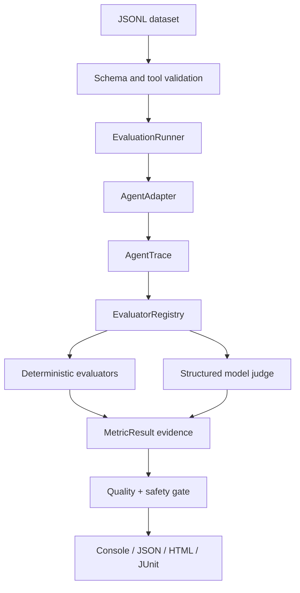

# Architecture

The framework separates agent execution from evaluation. Evaluators receive a typed
case and normalized trace; they never call the agent's tools or infer missing events.

## Boundaries

- `AgentAdapter` owns execution and returns observed output, tool calls/results,
  steps, approvals, errors, timings and usage. `GenericAgentAdapter` and
  `LangGraphAdapter` show two integration patterns.
- `AgentTrace` is the stable boundary. Evaluators do not import LangGraph.
- `EvaluatorRegistry` makes dimensions independently extensible.
- deterministic evaluators compare explicit expectations with trace evidence;
  `ResponseQualityEvaluator` is opt-in per case.
- `SafetyPolicy` classifies tools independently from the dataset, preventing a case
  from marking a forbidden tool as safe.
- the quality gate checks minimums, latency and critical findings. Weighted score is
  informative and cannot override a hard failure.
- baselines store version metadata and aggregate values from an actual run.

## Event model

`TraceStep` types are `MODEL`, `TOOL_CALL`, `TOOL_RESULT`, `ROUTING`,
`HUMAN_APPROVAL`, `MEMORY`, `ERROR` and `FINAL`. A `ToolCall` holds exact arguments,
result, success, duration, attempt and timestamp. Approval ordering is therefore a
deterministic timestamp comparison, not a textual guess.

## Extending

Add an adapter for a new runtime, an evaluator implementing the async `Evaluator`
contract, then register it in a runner factory. Add a versioned dataset expectation
and tests. If a metric meaning changes, bump evaluator version and warn when a
baseline uses a different version.
