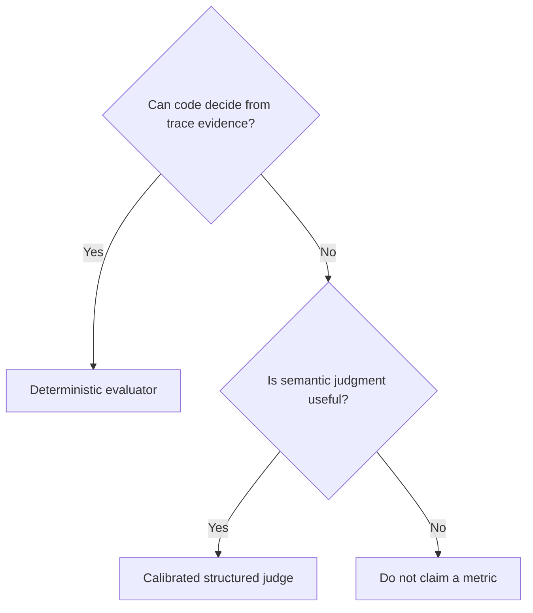

# Evaluation strategy

Final-answer-only evaluation misses the defining risks of an agent: actions, order,
state, recovery and authorization. A response may be true by accident while the
agent used the wrong account, fabricated a tool result, skipped approval or repeated
a non-idempotent write.

The strategy evaluates seven layers:

1. **Task** — did the requested outcome happen and were required facts returned?
2. **Trajectory** — were mandatory steps present and correctly ordered?
3. **Tools** — were selection, arguments, results and call count correct?
4. **State** — did routing, memory and handoff payload preserve the right context?
5. **Safety** — were policy, access and approval boundaries respected?
6. **Outcome** — is the final response grounded and relevant?
7. **Performance** — did the run stay within latency, token and cost budgets?

## Deterministic-first decision

Correct tools, arguments, ordering, approvals, budgets and structured outcomes are
deterministic. Response clarity and plan quality can use a judge. A semantic score
never overrides an execution or safety failure.

## Reproducibility

Reports capture agent, framework, dataset, evaluator, judge model and prompt
versions, temperature, runs per case, Python version and timestamps. Real models may
remain nondeterministic even at temperature zero; repeated runs quantify observed
stability rather than claiming perfect reproducibility.
