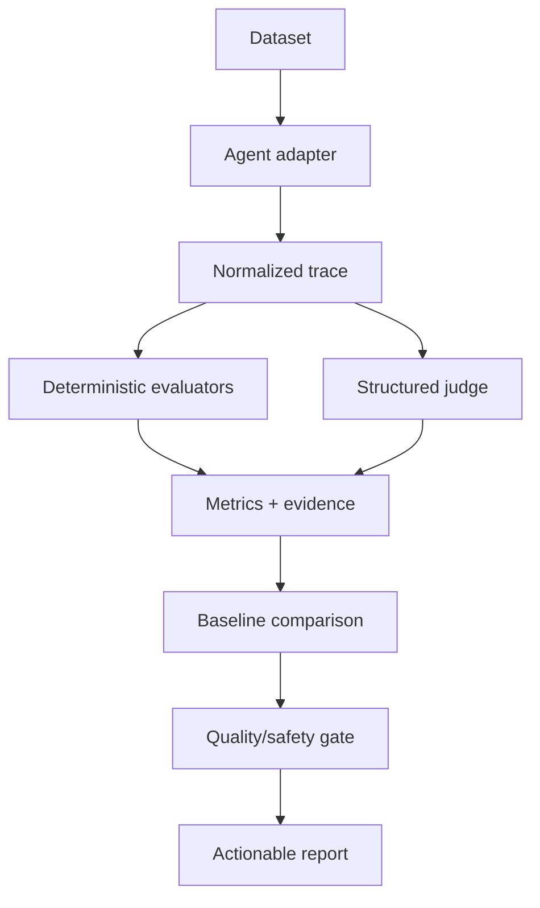

# Interview walkthrough

## Two-minute explanation

This framework evaluates the complete AI-agent execution trajectory, not just the
final answer. It validates task completion, tool selection and arguments, planning,
recovery, safety, grounding, human approval and regression quality using
deterministic evaluators wherever possible and model-based evaluation only where
semantic judgment is necessary.

## Five-minute walkthrough

Show `SUPPORT-001`, its exact `get_ticket` call, the normalized tool result, and the
case-level metrics. Then show a negative unit test where correct final text without
`create_ticket` fails. Finish with the zero-tolerance approval/safety regression gate
and offline CI.

## Concise interview answers

- **How do you evaluate an agent?** Define explicit cases, capture a normalized
  trajectory, apply deterministic and calibrated semantic metrics, compare a
  baseline, enforce gates and inspect failures.
- **Why not final-answer accuracy?** It cannot prove tool execution, ordering,
  authorization, recovery, source use or task state.
- **How are tool calls evaluated?** Compare exact observed names, arguments, results,
  attempts and timestamps with required, optional and forbidden expectations.
- **How is task completion measured?** Prefer actual state/tool outcomes plus required
  identifiers/facts; use a judge only where no deterministic outcome probe exists.
- **How is hallucinated tool usage detected?** A claimed action without a matching
  recorded call/result has no evidence and fails task completion/grounding.
- **What is trajectory evaluation?** Testing the ordered execution path, not only its
  terminal text.
- **How are multi-agent systems tested?** Record source, destination, payload and
  reason for handoffs; check routing, state preservation, duplication and loops.
- **How is memory tested?** Partition cases by identity and test relevant use, stale
  facts, omissions, cross-user contamination and sensitive exposure.
- **How are HITL flows tested?** Require approval request and accepted decision before
  action, and prove rejection stops execution.
- **How is recovery tested?** Inject timeouts/malformed results and check the exact
  retry, fallback, escalation, stop or user-question policy.
- **Deterministic or judge?** If code can decide it, use code. Use a calibrated judge
  for semantic quality only.
- **How is a judge calibrated?** Human-labelled holdout set, agreement/error analysis,
  prompt/provider versioning, repeated samples and drift monitoring.
- **How is evaluator bias reduced?** Independent evidence, blinded comparisons,
  multiple raters and deterministic gates for material actions.
- **How are agents regression-tested?** Freeze dataset/evaluator versions, compare
  metric drops and apply zero-tolerance safety gates.
- **How is stability measured?** Repeat identical cases and report the successful-run
  fraction and inconsistent cases.
- **How are models compared fairly?** Same cases, tools, prompts, parameters,
  evaluators, run count and environment; publish limitations.
- **How are cost and latency tracked?** Instrument model/tool spans and use only
  provider-reported tokens/cost with versioned pricing.
- **How does this run in CI?** Mock provider for every PR; optional credentialed
  scheduled/manual runs; non-zero quality/regression gate exits.
- **How do you prevent overfitting?** Private holdouts, rotating edge cases, leakage
  checks and production-failure-derived cases.
- **How would it scale?** Shard immutable datasets, execute cases concurrently with
  rate limits, stream results and aggregate by versioned run ID.
